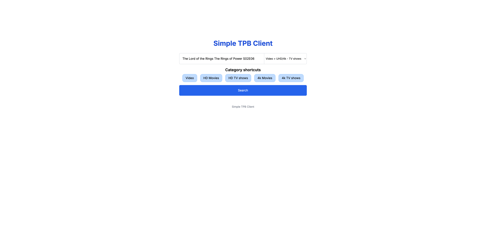
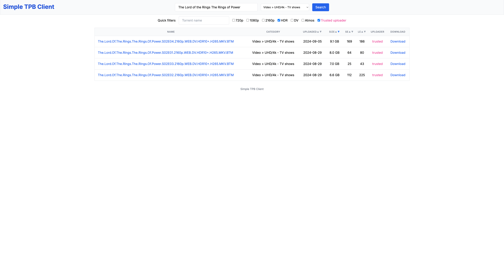
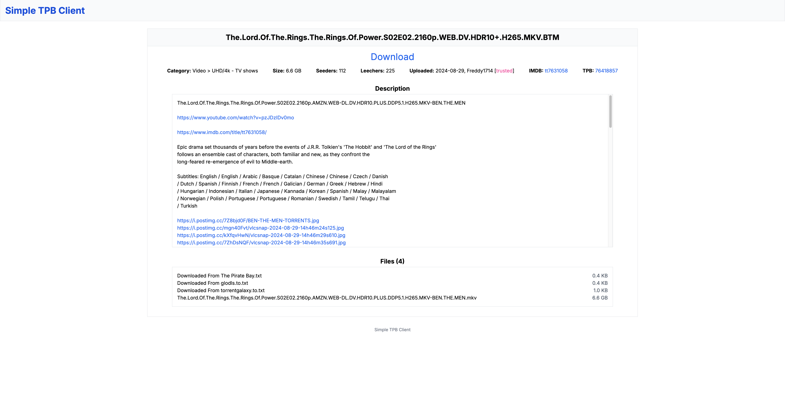

# Simple TPB Client

An unofficial website for searching and downloading torrents from TPB (The Pirate Bay). This project is not publicly deployed by me, so if you’d like to use it, you’ll need to host it yourself or run it locally.

### Features

- Home page
  - Search by torrent name and category (includes all categories available on TPB)
  - Category shortcuts: quick-access buttons for frequently used categories (Video, HD Movies, HD TV Shows, 4k Movies, 4k TV Shows) to simplify the selection from the larger category dropdown
- Search result page
  - Results table: displays torrent details including: torrent name, category (parent > child), upload date, size, seeders and leechers count, colored uploader status (member, vip, trusted, moderator), download link
  - Sorting: sort results by upload date, size, seeders, or leechers.
  - Quick Filters: instantly narrow down results without additional server requests
    - Torrent name: free-text search within torrent names
    - Video-specific checkboxes (search within torrent names): 720p, 1080p, 2160p, HDR, DV, Atmos
    - Trusted uploader checkbox: shows torrents uploaded only by trusted members
  - Torrent details navigation: click on a torrent name to navigate to its details page
  - New search: update the torrent name and/or category at the top of the page to perform a new search
- Details page
  - Torrent name and download link
  - Basic details such as category, size, seeders, leechers, upload date, uploader's username and status, IMDB link (if available), TPB link
  - Description: torrent description, contains clickable links
  - File list: view the list of files included in the torrent, along with their sizes

### Used technologies

- FE: React, Nextjs, TypeScript
- BE: Nodejs, Nextjs, TypeScript

### Screenshots





### Demo video

https://www.youtube.com/watch?v=Ee41l2mO_f8

### How to start
Dev mode
```
npm i
npm run dev
```

Optimized production mode
```
npm i
npm run build
npm start
```

### License

The MIT License (MIT)
